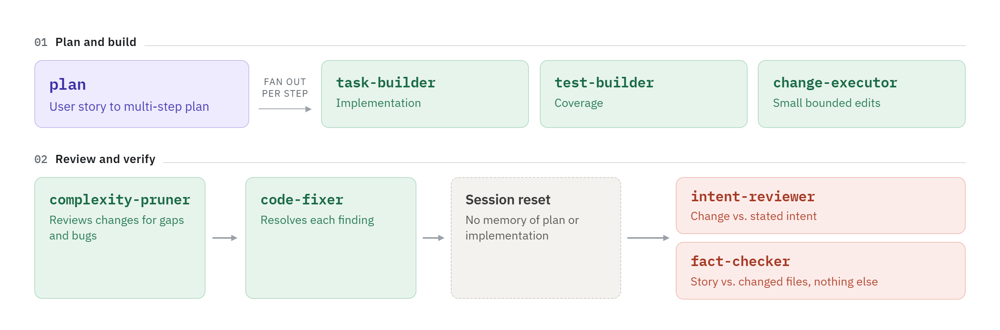

# Coding Agents & Skills
A collection of specialized subagents and skills for [Claude Code](https://claude.com/claude-code), designed to enhance AI-assisted development workflow with focused, expert capabilities.

<picture>
  <source media="(prefers-color-scheme: dark)" srcset="docs/pipeline-dark.png">
  <source media="(prefers-color-scheme: light)" srcset="docs/pipeline-light.png">
  
</picture>

## What are Custom Subagents?
Custom subagents are specialized AI assistants in Claude Code that focus on specific tasks. Each subagent is optimized with:
- Tailored instructions for their domain
- Specific tool permissions
- Clear operational guidelines

## What are Skills?
Skills are packaged instructions Claude Code loads into the current context for a specific procedure — a checklist, a repo-specific workflow, a verification routine — rather than a separate agent identity. No isolated context, no tool-grant frontmatter to maintain; use one when the task is procedural rather than a role requiring judgment and boundaries.

## Repo Purpose
This repo was created to use at work the agents I built for my side projects. Initially, there weren’t many changes from the Claude Code scaffold, but over time I gradually learned more details — so yes, in part (though to a lesser extent) it’s also a learning project.
Every agent has now gone through a review pass, sometimes created by merging overly specialized definitions into a single one.

### What I’ve Learned
This is why agent definitions need refinement:
- Claude Code generates overly verbose descriptions in both content and YAML format, which is inefficient for context usage and useless when the **agent name** is explicitly specified in the prompt (ame and description metadata are loaded into the context at startup or with `/reload-plugins` command).
- The definition is **polluted with bold** and other text embellishments that only carry meaningful emphasis for **human readers**, without providing effective signals to the model.
- There are too many **blank lines** and **trailing periods** that could be removed to reduce token processing overhead.
- Some concepts are repeated with **excessive redundancy**.

## Which Agent to Install
Subagents run in isolated contexts, but their **metadata is loaded** into the parent context **at startup**, like other tools, adding some upfront token overhead at scale. For this reason, only include the subagents you actually need to avoid unnecessary context bloat.
It is preferable to **install them at the project level** to maintain tighter control over the context.

## Available Subagents
**Common features**:
- Memory is disabled
- Model is set to `inherit`

### Code Navigation & Analysis
- **code-analyst v2.0** (5e1e102c) - Deeply understand how systems work by examining documentation, code, and related materials; trace implementation flows and clarify ambiguous specifications.
- **forensics-analyst v2.0** (b3844726) - Reverse-engineer explicitly provided files to trace data flow, decipher legacy logic, analyze schema evolution, and explain unfamiliar inherited code; no broad codebase scanning or modification.
- **convention-auditor v1.0** (791ab040) - Infers the naming convention a codebase actually follows and reports where a target scope deviates from it — casing drift, non-English identifiers, false-friend translations, homoglyph tricks; read-only, ignores string content.
- **rest-auditor v1.0** (874e4690) - Scans a REST endpoint set (all, or a natural-language scope like changed files or the last commit) framework-agnostically; reports anomalies against the set's own convention and per-endpoint test coverage (underlying code, HTTP-level integration); read-only.
- **bug-hunter v1.0** (5f1d700e) - Searches the whole codebase, or a restricted blast radius and/or bug kind, for defects across functional, UI/UX, performance, security, compatibility, integration, data, regression, usability, and concurrency classes; read-only, never delegates.
- **test-auditor v1.0** (67df68c5) - Audits existing test code for isolation, determinism, assertion strength, static mutation survival, boundary coverage, over-mocking, hallucinated APIs, data hygiene, secrets, disabled tests, and readability against the corpus's own convention; read-only, never flags defects in the production code under test.

### Planning & Architecture
- **solution-architect v2.0** (60d2e1d9) - Evaluate different implementation approaches and recommend optimal solutions for technical problems.
- **design-reviewer v2.0** (4baadbf8) - Identify unnecessary complexity and over-engineered patterns in specific code components or architectural decisions.
- **feature-planner v2.0** (edd5bb09) - Plan implementation changes for a submitted feature description; identify affected files, required changes, sequencing, and risks; can also review feature scope and codebase impact without planning implementation steps.
- **task-planner v2.0** (59c7aec6) - Analyze project state and develop strategic roadmaps for future development.
- **task-completer v2.2** (0249d9aa) - Systematically recover from failed tasks by learning from past attempts and identifying root causes.

### Development & Implementation
- **task-builder v2.2** (4280bcdf) - Implement development tasks from a single well-scoped step to a full feature translated from a design discussion, API spec, or documented requirement; also handles rewrites and rebuild-style refactors where the replacement is decided; declines requests with open design decisions remaining.
- **change-executor v2.3** (c9c70f58) - Execute a single, clearly scoped code modification (rename, value swap, signature adjustment, small addition/removal); declines requests that are too broad or require design decisions.
- **code-fixer v2.2** (5235bef0) - Apply targeted, minimal corrections to resolve compile errors, type mismatches, logic bugs, and precise modifications without touching unrelated code.
- **code-refactorer v2.3** (b04a87e6) - Refactor code with surgical precision while maintaining exact functionality and minimizing disruption.
- **feature-builder v1.0** (9e9d1040) - Orchestrates a feature or endpoint end to end by delegating to task-builder and test-builder, deciding coverage from repo convention; enforces unit and HTTP-client integration tests on REST endpoints.
- **complexity-pruner v4.1** (ce9f41b5) - Reduce over-engineering, unnecessary abstractions, accidental complexity, dead code, and unused dependencies while preserving identical behavior — with explicit reachability/usage guardrails against false-positive removal; also identifies behavior- and contract-preserving refactorings and delegates them to code-refactorer when available; on request, runs as a read-only review that reports findings without applying them.
- **comment-sweeper v1.0** (4ecf1165) - Removes zero-signal comments and flags ones that contradict or drifted from the code they annotate; standard mode edits, review mode reports only.
- **frontend-builder v3.1** (b29a389e) - Modify or build frontend components, pages, layouts, styles, and interface copy across any stack with surgical precision; operates in an explicit match or design mode, and when building from scratch grounds a distinctive aesthetic direction in the subject, critiques it against known defaults, and holds a responsive/keyboard/reduced-motion quality floor.

### Testing & Quality
- **test-builder v2.2** (d55ebcd8) - Design and implement spec-driven test suites with traceable assertions and systematic edge case coverage; can also produce spec-only coverage plans without writing code.
- **test-fixer v2.2** (82ab0d38) - Identify and repair broken tests after code changes; on request can diagnose-only or fix the implementation code rather than tests.
- **fact-checker v2.0** (61ee9fdd) - Compare exactly two inputs — assertions, documentation, code, or test output — for semantic, structural, or behavioral consistency; declines anything other than a single pair.
- **dotnet-cs-expert v1.1** (3f01c615) - Statically verify a C#/.NET solution for defects that compile clean and evade standard analyzers — DI wiring gaps, async hygiene, resource leaks, config drift, cross-project dead code, unused NuGet/Paket dependencies, nullable erosion, AI-generation smells, EF Core migration alignment, and version-gated syntax advisories; read-only and report-only, recommends live-database checks rather than performing them.

### Documentation & Maintenance
- **docs-maintainer v.21** (2ce533de) - Create and update Markdown or readable documentation — for AI, humans, or both — keeping it accurate and synchronized with the codebase; operates on provided context, minimal project scanning.

## Available Skills
- **code-engineer v1.0** (0dc3e8da) - Language-agnostic engineering discipline for writing and changing code: naming, responsibilities, complexity, control flow, state, errors, coupling, abstraction, testability, concurrency, performance, and change hygiene; Coder mode edits, Reviewer mode reports only.
- **dotnet-preflight v1.1** (c37aa44d) - Verifies a .NET backend feature branch is safe to open a PR: solution builds cleanly, EF Core migrations are healthy against the local dev database, and the application starts without error; verification only, never fixes what it finds.
- **dotnet-warning-audit v1.2** (5b1d65fe) - Compiles a .NET solution or project and reports every build warning grouped by severity (critical/high/medium/low), with a suppression inventory and per-project totals; forces a full rebuild so incremental builds cannot hide warnings; report only, never fixes.
- **react-preflight v1.0** (f4c60ab7) - Verifies a React frontend feature branch is safe to open a PR: dependencies install from an undrifted lockfile, the app typechecks/lints/builds, the test suite is green and actually ran, and the dev server and production preview both start without error; verification only, never fixes what it finds.

## Installation
The steps below cover agents only — `scopy` is wired to sync from `agents/`. Skills have no sync tooling yet: copy the `skills/<skill-name>/` directory manually into your project's or user's `.claude/skills/`

1. Install [scopy](https://github.com/gsscoder/super-copy):
```bash
npm install -g @koder0x/scopy@next
```

2. Register this repo as a source:
```bash
scopy source add cc-agents https://github.com/gsscoder/claude-coding-agents/agents
```

3. Register your destination:
```bash
# Project-level
scopy dest add my-project /path/to/your/project/.claude/agents

# User-level
scopy dest add user-agents ~/.claude/agents
```

4. Sync the agents you want:
```bash
# All implement agents
scopy sync cc-agents/agents/implement my-project --force

# All testing & quality agents
scopy sync cc-agents/implement my-project --force

# Specific agent
scopy sync cc-agents/agents/testing-quality/fact-checker.md my-project --force
```

## Usage
Even if subagents may be automatically invoked by Claude Code based on your request and the task context, it is better to explicitly specify the subagent in the prompt:
```
"Use the forensics-analyst subagent to reverse-engineer this module"
"I need the task-builder subagent to implement this spec"
```

## Porting to Other Tools
Agent definitions in `agents/` are self-contained Markdown files. To recreate them in another AI-assisted development tool, either feed the `description` field from the frontmatter as a prompt to generate a new definition, or manually port the full agent body adapting structure and syntax to the target tool's specification.

## Tracking File Versions
`.file-versions` at the repo root is a `sha256sum`-format manifest of every agent definition in `agents/` and every `SKILL.md` in `skills/` — a skill's supporting files are not individually tracked. It is a versioning aid, not an authenticity guarantee — its purpose is to let a deployment tool detect drift between the copy synced into a project and the source definition here, not to prove provenance. Verify with `sha256sum -c .file-versions`.

## License
MIT License - feel free to use and modify these agents for your projects.

## Resources
- [Claude Code Documentation](https://code.claude.com/docs/en/overview)
